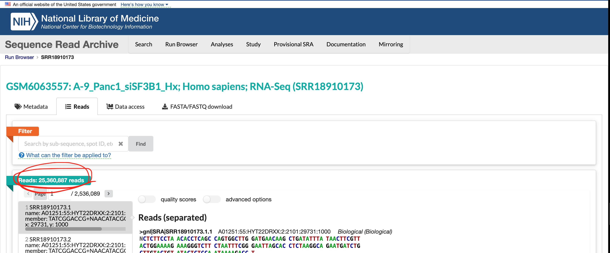

# 1- Dataset Overview

**Selected Dataset**     
The dataset I selected is called "SF3B1 promotes glycolysis and tumor malignancy through splicing-independent activation of HIF1α [RNA-Seq]" (GEO accession: GSE201427). Details about the dataset can be found in the [next section](#information-about-the-series-gse).

**About the Dataset's Affiliated Publication**     
The dataset along with its publication in Cell was published in 2022. The main publication focuses on understanding the role of splicing factor SF3B1 in tumor progression. This study was conducted with the hypothesis that the upregulation of wild-type SF3B1 in tumors allows for adaptation to hypoxia. The supporting reasons for this hypothesis were the prior findings that in the heart overexpression of SF3B1 is induced by hypoxia, and that solid cancers are poorly oxygenated [@simmler2022sf3b1].

<a id="q2"></a>
**About the Experiment**  \
The dataset I am using from this study is bulk RNA sequencing data of six PANC-1 cell line samples. Half of these samples were treated with control siRNA and the other half were treated with SF3B1 targeting siRNA (essentially a SF3B1 knockout), with all samples subject to 1% oxygen or hypoxic conditions [@simmler2022sf3b1]. The dataset actually includes another group but it will be omitted in my analysis since there are not enough samples ([read more here](#groups)).  

<a id="q1"></a>
**Why I Chose this Dataset** \
In the process of selecting a dataset, I set the following criteria: 1) it is part of a cancer research study, 2) the data is recent and usable quality as defined in the assignment instructions, and 3) it is published by an institution I am interested in applying to so that I can learn more about the research being done there. A list of datasets I considered in the selection process can be found in my [course journal entry](https://github.com/bcb420-2025/Izumi_Ando/wiki/Entry-7%3A-Process-of-Finding-a-Dataset). 

On top of satisfying the criteria above, I chose this dataset because I found this experiment interesting due to the complex nature of the biologial pathway being studied (as can be seen in the study's hypothesis above). Moreover, understanding the differential expression patterns due to the presence of SF3B1 could not only contribute to cancer research but also understanding how gene expression contributes to cells surviving in environments with limited vasculature.

# 2 - Downloading the Data

This dataset can be downloaded from the Gene Expression Omnibus (GEO) databse using the R package `GEOquery` [@geoquery], and read into R using the `readxl` package [@readxl]  included in the `tidyverse` package [@tidyverse]. The bulk of the code used in this section was taken and modified from BCB420 Lecture 4 "Get the Data" [@lec4_get_data]. A summary of the dataset is included at the bottom of this section.

**Installing and Attaching Necessary R Packages**     
```{r warning=FALSE, message=FALSE}
if (!require("BiocManager", quietly = TRUE)) {
  install.packages("BiocManager")
}
if (!requireNamespace("GEOquery", quietly = TRUE)) {
  BiocManager::install("GEOquery")
}
if (!requireNamespace("tidyverse", quietly = TRUE)) {
  install.packages("tidyverse")
} # readxl included in tidyverse install

library("GEOquery")
library("tidyverse")
library("readxl")  # must attach explicitly
```

**Downloading and Reading In the Data**    
```{r warning=FALSE, message=FALSE}
# code mainly taken from BCB420 Lecture 4 Get the Data
# getting the GEO description
geo_id <- "GSE201427"
gse <- GEOquery::getGEO(geo_id, GSEMatrix=FALSE)
supp_files <- GEOquery::getGEOSuppFiles(geo_id, fetch_files=FALSE)

# getting information about GPL
gpl_name <- names(GEOquery::GPLList(gse))[1]
gpl <- GEOquery::Meta(GEOquery::getGEO(gpl_name))

# getting the data file name (there is only one file for this dataset)
data_file <- supp_files$fname[1]

# only downloading dataset if it is not available locally
dir <- file.path(getwd())
data_file_path <- file.path(dir, geo_id, data_file)
if(!file.exists(data_file_path)){
  data_file_download <- GEOquery::getGEOSuppFiles(geo_id, 
                                                filter_regex = data_file, 
                                                baseDir = dir, 
                                                fetch_files = TRUE)
}

# reading in the data 
panc1_data <- readxl::read_xlsx(data_file_path) 
```

### Information About the Series (GSE)

**Title:** `r gse@header$title`\
**GEO Accession:** `r gse@header$geo_accession`\
**Submission Date:** `r gse@header$submission_date`\
**Last Update:** `r gse@header$last_update_date`\
**Associated Publication PubMed ID:** `r gse@header$pubmed_id`\ 
**Contact Information:**\
   **Contact Name:** `r gse@header$contact_name`\
   **Contact Institute:** `r gse@header$contact_institute`\
   **Contact Name:** `r gse@header$contact_email`

### Information About the Platform (GPL)

**Platform Name:** `r gpl$title`\
**GEO Accession:** `r gpl$geo_accession`\
**Number of Associated Samples on Geo:** `r length(gpl$sample_id)`\


# 3 - Assessing the Data

### A Glance at the Data

Below is a view of the dataset as it is. We can see that there are two columns for EntrezIDs and gene symbols, and 8 columns for read counts. (Formatting for the data is done by the R package `knitr` [@knitr].) An important point to note is that the values in the dataset are already in **log2-CPM** normalized form. I realized this by the fact that 1) the data file has "CPM" in the title, 2) there are negative values, and 3) when I reverse calculated the sum of the $\frac{\text{Raw Count}}{\text{Total Reads in Sample}}$ for each column, it only made sense that it could be a log of base 2. The calculations for the first column are included below.
```{r warning=FALSE, message=FALSE}
if (!require("knitr", quietly = TRUE)) {
  install.packages("knitr")
}

library("knitr")

# printing out the first 3 rows of the data
knitr::kable(head(panc1_data, 3), format = "html", align = "c")
```

```{r warning=FALSE, message=FALSE}
b10<- sum((10^panc1_data$"A-1_Panc1_siCtrl_Nx") / 1000000)
b2<- sum((2^panc1_data$"A-1_Panc1_siCtrl_Nx") / 1000000)

cat("If we assume it is log base 10, the sum of the raw counts over total reads 
    would be", b10, "but if we assume log base 2 it would be", b2)
```

<a id="groups"></a> \
### Groupings of the Data
Here we organize the groupings of the samples in the dataset. There are three groupings based on the oxygen exposure and siRNA treatment labels.

The sample names are formatted the the following way "A_NUM_Panc1_EXP_O2" where NUM is the sample number, EXP is the experiment group either control siRNA (siCtrl) or SF3B1 targeting siRNA (siSF3B1), and O2 is the oxygen level (Hx for hypoxia or 1%, and Nx for normoxia or 21%). The original data file seems to only include 8 samples although the GSE201427 description states that there are 9.  As mentioned earlier, the downstream analysis will only use two of the three groupings omitting the normoxia group as it does not have enough samples. 
```{r warning=FALSE, message=FALSE}
# modified code from lecture 4 get the data 
list_of_samples <- gse@gsms
samples_type <- do.call(rbind, 
                        lapply(list_of_samples,
                               FUN = function(x){c(x@header$title, 
                                                   x@header$characteristics_ch1)
                                 }))
colnames(samples_type) <- c("Sample Name", "Oxygen Exposure", 
                            "siRNA Treatment", "Cell Line")

samples_type[, "Oxygen Exposure"] <- gsub(samples_type[, "Oxygen Exposure"],
                                          pattern = "condition: ",
                                          replacement = "")

samples_type[, "siRNA Treatment"] <- gsub(samples_type[, "siRNA Treatment"],
                                          pattern = "treatment: ",
                                          replacement = "")

samples_type[, "Cell Line"] <- gsub(samples_type[, "Cell Line"],
                                          pattern = "cell line: ",
                                          replacement = "")

samples_type <- as.data.frame(samples_type)

knitr::kable(samples_type, format = "html", align = "c")
```

### Statistics About the Dataset

**Number of genes:** `r nrow(panc1_data)`\
**Number of Entrez IDs:** `r nrow(panc1_data) - nrow(panc1_data[panc1_data$EntrezID == "NA", ])`\
**Number of Gene Names:** `r nrow(panc1_data) - nrow(panc1_data[panc1_data$Gene == "NA", ])`\

### Plotting the Data

Here we plot the density plot and box plot of the unfiltered data to visualize its distribution. The code is mostly taken from BCB420 Lecture 5 Normalization [@lec5_norm].    

**Observations**     
From the density plot we can see that the data mostly follows a normal distribution with a small peak on the left side. The blox plots show that the distribution is generally equal amongst the samples, with very few high-value outliers (2-3) for each sample. Given the small number of outliers I have decided not to remove them.
```{r warning=FALSE, message=FALSE}
# Removing extra columns for different O2 exposure levels
panc1_data <- panc1_data[, c(1, 2, 5, 6, 7, 8, 9, 10)]

# Extract only numeric data (third column onwards)
numeric_data <- panc1_data[, 3:ncol(panc1_data)]


# Calculate density for each sample (column-wise)
# Note this data is already log cpm
counts_density <- apply(numeric_data, 2, density)

# Determine x and y limits across all samples
xlim <- range(sapply(counts_density, function(d) d$x))
ylim <- range(sapply(counts_density, function(d) d$y))

# Assign colors to each sample
cols <- rainbow(length(counts_density))
ltys <- rep(1, length(counts_density))

# Initialize an empty plot
plot(counts_density[[1]], xlim=xlim, ylim=ylim, type="n",
     xlab="log-CPM", ylab="Density",
     main="Density Plot of log2-CPM PANC-1 RNA-seq Data, Unfiltered",
     cex.lab=0.85)

# Add density curves for each sample
for (i in 1:length(counts_density)) {
  lines(counts_density[[i]], col=cols[i], lty=ltys[i])
}

# Add legend
legend("topright",
       legend=colnames(numeric_data),
       col=cols, lty=ltys, cex=0.75, ncol=1,
       border="blue", text.col="black",
       merge=TRUE, bg="gray90")
```

```{r warning=FALSE, message=FALSE}
# taken from lecture5_normalization
# using data from code chunk above
boxplot(numeric_data, xlab = "Samples", ylab = "log-CPM",
        las = 2, cex = 0.75, cex.lab = 0.75,
        cex.axis = 0.75, main = "Box Plot of of log2-CPM PANC-1 RNA-seq Data, 
        Unfiltered")

# median for each box
abline(h = median(apply(numeric_data, 2, median)),
       col = "purple", lwd = 1.0, lty = "dashed")
```

# 4 - Mapping Identifiers

The initail dataset contained both EntrezIDs and HUGO gene symbols. All rows had EntrezIDs but not HUGO symbols so I attempted to map the EntrezIDs to HUGO symbols myself to see if I can increase the number of mappings. I first attempted this using the R package `biomaRt` [@Durinck2005] [@Durinck2009] but I could not resolve the error. Thus I tested an alternative tool, the R annotation package `org.Hs.eg.db` [@converter].

```{r warning=FALSE, message=FALSE}
if (!requireNamespace("org.Hs.eg.db", quietly = TRUE)) {
  install.packages("org.Hs.eg.db")
}

library("org.Hs.eg.db")

# extracting EntrezIDs
panc1_ids <- as.vector(panc1_data[, 1])
panc1_ids <- as.character(unlist(panc1_ids))
# AnnotationDbi is a dependency of org.Hs.eg.db
mapped <- AnnotationDbi::select(org.Hs.eg.db, keys=panc1_ids, 
                                columns=c("ENTREZID", "SYMBOL"), 
                                keytype = "ENTREZID")

# creating a data frame with the EntrezIDs, HUGO symbols from org.Hs.eg.db, 
# and HUGO symbols from the original dataset
joined <- cbind(mapped, panc1_data[, 2])
```

<a id="q5"></a>

**Number of rows without HUGO symbols after mapping with `org.Hs.eg.db`:** `r nrow(mapped[mapped$SYMBOL == "NA", ])`\
**Number of rows without HUGO symbols in the initial dataset:** `r nrow(panc1_data[panc1_data$Gene == "NA", ])`\
**Number of rows missing HUGO symbols in both the initial dataset and after mapping with `org.Hs.eg.db`:** `r nrow(joined[joined$Gene == "NA" & joined$SYMBOL == "NA", ])`

As we can see from above, the mappings from EntrezIDs to HUGO symbols were not improved using `org.Hs.eg.db`. Thus, I decided to keep the HUGO gene symbols from the original dataset and omit any rows where the HUGO identifiers were labeled "NA". This only reduces the dataset size by under 1%.

**Removing Rows without HUGO Symbols**
```{r warning=FALSE, message=FALSE}
# removing all rows without hugo symbols
hugo_panc1_data <- panc1_data[panc1_data$Gene != "NA", ]

# reformatting data frame
geneCol <- hugo_panc1_data$Gene
hugo_panc1_data <- hugo_panc1_data[, 3:length(hugo_panc1_data)] # removing extra gene identifier columns
rownames(hugo_panc1_data) <- geneCol # assigning HUGO symbols as the row names

# latest version of the dataset after this step
# hugo_panc1_data
```

# 5 - Cleaning Data

### Removing Low Counts
Here we clean the data based on the approach introduced in BCB420 Lecture 5 Normalizing Our Dataset [@lec5_norm_data] where low counts are omitted on a counts per million (CPM) basis. In other words, half of the samples must have a read count over a certain threshold for a given gene for the gene to be included.  
```{r warning=FALSE, message=FALSE}
# code taken from lecture 5 normalizing our dataset
# the min number of samples is three because the total number of samples is 6
min_num_samples <- 3
# removing log from data values
cpm_non_log <- 2^hugo_panc1_data
data_matrix <- as.matrix(cpm_non_log)
keep <- rowSums(data_matrix > 1) > min_num_samples

filtered_panc1_data <- as.data.frame(data_matrix[keep,])
filtered_panc1_data <- log(filtered_panc1_data, base = 2) # back to log2-CPM

rem_rows <- nrow(hugo_panc1_data) - nrow(filtered_panc1_data)
cat(rem_rows, "rows were removed in this step which leaves us with", nrow(filtered_panc1_data), "genes left in the dataset." )
```

<a id="q4"></a>

### Checking for Duplicate Rows and Genes

Just in case, I checked if there are any rows with the same read counts or with the same gene symbol. However, there were no duplicate rows and thus nothing was removed.

```{r warning=FALSE, message=FALSE}
# checking for rows with the same read values by viewing data from both ends
duplicates <- duplicated(filtered_panc1_data) | duplicated(filtered_panc1_data, 
                                                           fromLast = TRUE)
num_dups <- length(filtered_panc1_data[duplicates, ])

# checking for rows with the same gene names
# geneCol is a list of HUGO symbols from the previous section
num_dup_genes <- length(unique(geneCol)) - length(geneCol)

cat("There are", num_dups, "rows with the same read values and", num_dup_genes, 
    "rows with the same gene name.")
```

<a id="q6"></a>

### Plotting the Filtered Dataset

Here we plot the density plot and box plot to see how this filtering changed the distribution of the data. From the density plot we can see that the filtering pushed the distribution closer to a normal distribution by shrinking the peak on the left. From the box plot we can see that filtering highlighted more outliers both on the low and high ends. Given that the number of high-value outliers look similar across samples, it is plausible that these are simply highly expressed genes, and thus I will not be removing them. The publication did not mention how they dealt with outliers.
```{r warning=FALSE, message=FALSE}
# Calculate density for each sample (column-wise)
#counts_density <- apply(log2(numeric_data), 2, density)
# realized this data is already log cpm
counts_density <- apply(filtered_panc1_data, 2, density)

# Determine x and y limits across all samples
xlim <- range(sapply(counts_density, function(d) d$x))
ylim <- range(sapply(counts_density, function(d) d$y))

# Assign colors to each sample
cols <- rainbow(length(counts_density))
ltys <- rep(1, length(counts_density))

# Initialize an empty plot
plot(counts_density[[1]], xlim=xlim, ylim=ylim, type="n",
     xlab="log-CPM", ylab="Density",
     main="Density Plot of log2-CPM PANC-1 RNA-seq data, filtered",
     cex.lab=0.85)

# Add density curves for each sample
for (i in 1:length(counts_density)) {
  lines(counts_density[[i]], col=cols[i], lty=ltys[i])
}

# Add legend (using column names from numeric data)
legend("topright",
       legend=colnames(numeric_data),
       col=cols, lty=ltys, cex=0.75, ncol=1,
       border="blue", text.col="black",
       merge=TRUE, bg="gray90")

```

```{r warning=FALSE, message=FALSE}
# taken from lecture5_normalization
# using data from code chunk above
boxplot(filtered_panc1_data, xlab = "Samples", ylab = "log2-CPM",
        las = 2, cex = 0.75, cex.lab = 0.75,
        cex.axis = 0.75, main = "Box Plot of of log2-CPM PANC-1 RNA-seq Data, 
        Filtered")

# median for each box
abline(h = median(apply(filtered_panc1_data, 2, median)),
       col = "purple", lwd = 1.0, lty = "dashed")
```

# 6 - Normalizing the Data

As mentioned earlier, the original dataset came in log2-CPM normalized format. However, log2-CPM normalization is not ideal for differential expresison analysis, especially compared to Trimmed Mean of M-values (TMM) or DESeq2 Size Factors [@evans2018selecting]. Thus, I decided to examine the separation of my data in its original log2-CPM normalized form and in TMM normalized form to see if there is a significant difference. I computed the TMM using `edgeR` R package [@robinson2010edger], and the multidimensional scaling (MDS) plots using `limma` [@limma].

## log2-CPM (Original Data)
Below is the MDS plot of the log2-CPM normalized data. We can observe good separation between the two groups. I did not plot the density and box plots as they already have been plotted earlier.
```{r warning=FALSE, message=FALSE}
group_assignment <- samples_type$"siRNA Treatment"[3:length(samples_type$"siRNA Treatment")]

limma::plotMDS(filtered_panc1_data, labels=NULL, pch=1,
               col = c("turquoise", "purple")[factor(group_assignment)])

legend("top", legend=levels(factor(group_assignment)), pch=c(1), col=c("turquoise", "purple"), title="Class", bty="n", cex=0.75)
```

## TMM
To normalize this dataset by TMM, I first reverse calculated the raw read counts by reversing the formula for log2-CPM (below) by manually collecting the read depths of each sample from the Sequence Read Archive (SRA) Run Selector [@sra_run_selector]. From there I computed the TMM normalized values using `edgeR` as mentioned earlier, and plotted the density plot, box plot, and MDS plot to compare with the log2-CPM normalized dataset. The TMM normaliztion code is taken from BCB420 Lecture 5 Normalizing Our Data [@lec5_norm_data].     
$$
\log_2 \text{CPM}_i = \log_2 \left( \frac{\text{Raw Counts} + 1}{\text{Total Reads in Sample}} \times 10^6 \right)
$$

**Collecting Read Depths** \
```{r warning=FALSE, message=FALSE}
# find read depths for all samples
gsm_accession <- gse@header$sample_id[3:length(gse@header$sample_id)]
srr_accession <- c("SRR18910178", 
                   "SRR18910177",
                   "SRR18910176",
                   "SRR18910175",
                   "SRR18910174",
                   "SRR18910173")
rd <- c(26644141, 
        25605704,
        27703630,
        27589690,
        29387569,
        25360887)
read_depths <- cbind(gsm_accession, srr_accession, rd)
sample_name <- samples_type$`Sample Name`[3:length(samples_type$`Sample Name`)]
rownames(read_depths) <- sample_name
read_depths <- as.data.frame(read_depths)
read_depths$rd <- as.numeric(read_depths$rd)

# The read counts were taken from the links below in order.
# https://trace.ncbi.nlm.nih.gov/Traces/index.html?view=run_browser&page_size=10&acc=SRR18910178&display=metadata
# https://trace.ncbi.nlm.nih.gov/Traces/index.html?view=run_browser&acc=SRR18910177&display=metadata
# https://trace.ncbi.nlm.nih.gov/Traces/index.html?view=run_browser&acc=SRR18910176&display=metadata
# https://trace.ncbi.nlm.nih.gov/Traces/index.html?view=run_browser&acc=SRR18910175&display=metadata
# https://trace.ncbi.nlm.nih.gov/Traces/index.html?view=run_browser&page_size=10&acc=SRR18910174&display=metadata
# https://trace.ncbi.nlm.nih.gov/Traces/index.html?view=run_browser&page_size=10&acc=SRR18910173&display=meta

knitr::kable(read_depths, format = "html", align = "c")
```

**Figure 1: Screenshot of the NCBI SRA page that displays the read depth for an experiment**
Link to page: https://trace.ncbi.nlm.nih.gov/Traces/index.html?view=run_browser&page_size=10&acc=SRR18910173&display=reads

**Reverse Calculating Raw Counts** \
```{r warning=FALSE, message=FALSE}
# calculate the raw counts, power of 2, 
# not subtracting by 1, as it creates negative values
raw_panc1_data <- as.data.frame(2^filtered_panc1_data )

for(i in 1:length(sample_name)){
  sample <- sample_name[i]
  rd_value <- read_depths[rownames(read_depths) == sample, "rd"]
  raw_panc1_data[[sample]] <- raw_panc1_data[[sample]] * rd_value / 10^6
}
```

**Applying TMM Normalization** \
```{r warning=FALSE, message=FALSE}
if (!requireNamespace("edgeR", quietly = TRUE)) {
  install.packages("edgeR")
}

# apply edgeR normalization
library("edgeR")

# code taken from lecture 5 normalizing our dataset
d <- edgeR::DGEList(counts=raw_panc1_data, group=group_assignment)
d <- edgeR::calcNormFactors(d)
normalized_counts <- cpm(d)
```

**Plotting the Density Plot** \
```{r warning=FALSE, message=FALSE}
log_new <- log(normalized_counts, base = 2)

# Calculate density for each sample (column-wise)

counts_density <- apply(log_new, 2, density)

# Determine x and y limits across all samples
xlim <- range(sapply(counts_density, function(d) d$x))
ylim <- range(sapply(counts_density, function(d) d$y))

# Assign colors to each sample
cols <- rainbow(length(counts_density))
ltys <- rep(1, length(counts_density))

# Initialize an empty plot
plot(counts_density[[1]], xlim=xlim, ylim=ylim, type="n",
     xlab="log-CPM", ylab="Density",
     main="Density Plot of TMM normalized PANC-1 RNA-seq data, filtered",
     cex.lab=0.85)

# Add density curves for each sample
for (i in 1:length(counts_density)) {
  lines(counts_density[[i]], col=cols[i], lty=ltys[i])
}

# Add legend
legend("topright",
       legend=colnames(numeric_data),
       col=cols, lty=ltys, cex=0.75, ncol=1,
       border="blue", text.col="black",
       merge=TRUE, bg="gray90")

```

**Plotting the Box Plot** \
```{r warning=FALSE, message=FALSE}

# taken from lecture5_normalization
# using data from box above
boxplot(log_new, ylab = "log-CPM",
        las = 2, cex = 0.75, cex.lab = 0.75,
        cex.axis = 0.75, main = "Box Plot of TMM Normalized PANC-1 RNA-seq data, filtered")

# median for each box
abline(h = median(apply(log_new, 2, median)),
       col = "purple", lwd = 1.0, lty = "dashed")
```

**Plotting the MDS Plot** \
```{r warning=FALSE, message=FALSE}
limma::plotMDS(d, labels=NULL, pch=1,
               col = c("turquoise", "purple")[factor(group_assignment)])

legend("top", legend=levels(factor(group_assignment)), pch=c(1), col=c("turquoise", "purple"), title="Class", bty="n", cex=0.75)
```

**Observations**\
Comparing all the plots with those of the log2-CPM normalized data (from previous sections), there are no obvious differences in the data distribution nor the separation. Thus, I will be moving forward with my analysis with the TMM normalized data as is suggested.

# 7 - Conclusion
In this assignment, I have selected a dataset, assessed its quality, cleaned and normalized its values. The final form of the dataset is in TMM normalized reads with HUGO symbols as the row names and the sample names as the column names. The final form is in the R object `normalized_counts`, and the first 5 rows can be viewed below.
```{r warning=FALSE, message=FALSE}
head(normalized_counts, 5)
```

<a id="q8"></a> 

### A Few Statistics About the Final Dataset
**Number of Genes:** `r length(normalized_counts)`\
**Average Coverage Per Sample (in TMM):** `r mean(colSums(normalized_counts))`\

# 8 - Navigation for Marking

- Why is the dataset of interest to you? [section](#q1) \
- What are the control and test conditions of the dataset? [section](#q2) \
- How many samples in each of the conditions of your dataset? [section](#q2) \
- Were there expression values that were not unique for specific genes? How did you - handle these? [section](#q4)\
- Were there expression values that could not be mapped to current HUGO symbols? [section](#q5) \
- Were there any outliers in your dataset? How were they handled in the originating paper? How many outliers were removed? [section](#q6)\
- How did you handle replicates? [section](#q4)\
- What is the final coverage of your dataset? [section](#q8) \ 

# 9 - References