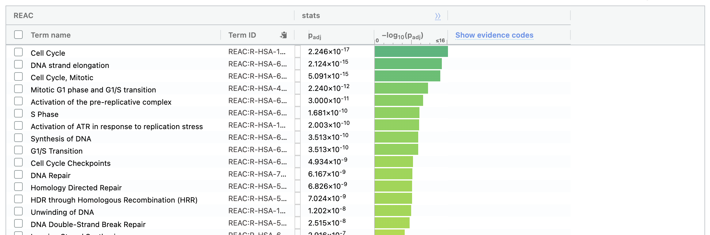
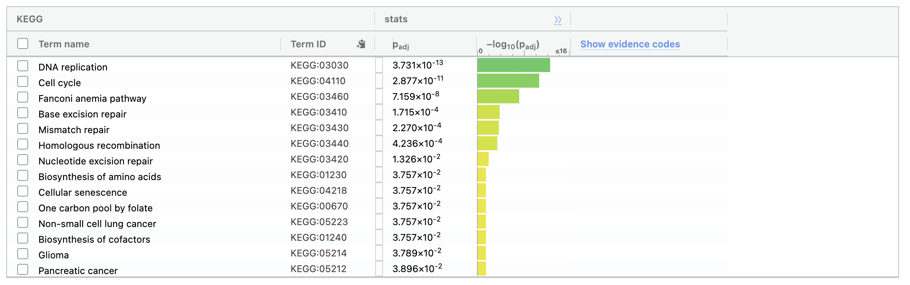

# 0 - Environment Set Up
Before we begin, we will install any packages not already provided in the environment and load all necessary libraries used in this analysis. The packages are cited in each section they are used. 
```{r warning=FALSE, message=FALSE}
if (!require("BiocManager", quietly = TRUE)) {
  install.packages("BiocManager")
}
if (!requireNamespace("GEOquery", quietly = TRUE)) {
  BiocManager::install("GEOquery")
}
if (!requireNamespace("tidyverse", quietly = TRUE)) {
  install.packages("tidyverse")
} # readxl included in tidyverse install
if (!require("knitr", quietly = TRUE)) {
  install.packages("knitr")
}
if (!requireNamespace("edgeR", quietly = TRUE)) {
  install.packages("edgeR")
}
if (!requireNamespace("limma", quietly = TRUE)) {
  BioManager::install("limma")
}
if (!requireNamespace("ggplot2", quietly = TRUE)) {
  install.packages("ggplot2")
}
if (!requireNamespace("ComplexHeatmap", quietly = TRUE)) {
  BioManager::install("ComplexHeatmap")
}
if (!requireNamespace("circlize", quietly = TRUE)) {
  install.packages("circlize")
}

# 1 - DATASET OVERVIEW
library("GEOquery") # to download dataset
library("tidyverse") # to use readxl
library("readxl")  # to read the datafile
library("knitr") # to produce visually cleaner tables
library("edgeR") # for TMM normalization & differential expression analysis
library("limma") # to generate the MDS plot

# 2 - DIFFERENTIAL GENE EXPRESSION ANALYSIS
library("ggplot2") # to create volcano plot
library("ComplexHeatmap") # to create heatmaps
library("circlize") # to adjust heatmaps
```

# 1 - Dataset Overview

**About the Dataset**       
The dataset I selected is called “SF3B1 promotes glycolysis and tumor malignancy through splicing-independent activation of HIF1α [RNA-Seq]” (GEO accession: GSE201427). this dataset was published as a part of a Cell publication understanding the role of splicing factor SF3B1 in tumor progression. Although the full study contained multiple datasets, I narrowed down to the bulk RNA sequencing dataset with 3 samples of Panc-1 cell line samples treated with control siRNA, and 3 samples of the same cell types treated with SF3B1 targeting siRNA. SF3B1 is a splicing factor hypothesized to be a contributor to a tumor's adaptation to hypoxia, or low oxygen environments [@simmler2022sf3b1]. 

**Overview of this Section**       
Below are the series of steps I followed in the previous assignment to download, clean, and normalize (Trimmed Mean of M-values (TMM)) the dataset. The code blocks will be preceded by short summaries of what was done in the process. 

### Loading in the data
I downloaded the dataset from Gene Expression Omnibus (GEO) databse using the R package `GEOquery` [@geoquery], and read in the data file using `readxl` [@readxl] which is included in the `tidyverse` package [@tidyverse]. The data files included two extra samples which I did not include in my analysis (given that there was a minimum requirement for sample numbers and we could not have more than two experimental groups). By the end of these code blocks we have our starting dataset only including the samples of interest along with a data frame characterizing each sample. The output of the code blocks will show 1) a glance of what the data looks like at this stage (Table 1) and 2) a table of the characteristics of each sample (Table 2). The section immediately after the code block are short descriptions of the dataset (also known as series) and the platform used to generate it. Most of this code was adapted from the lecture slides for BCB420 Lecture 4 "Get the Data" [@lec4_get_data]. 
```{r warning=FALSE, message=FALSE}
# code adapted from BCB420 Lecture 4 Get the Data

##### PART 1 - Downloading the data
# getting the GEO description
geo_id <- "GSE201427"
gse <- GEOquery::getGEO(geo_id, GSEMatrix=FALSE)
supp_files <- GEOquery::getGEOSuppFiles(geo_id, fetch_files=FALSE)

# getting information about GPL
gpl_name <- names(GEOquery::GPLList(gse))[1]
gpl <- GEOquery::Meta(GEOquery::getGEO(gpl_name))

# getting the data file name (there is only one file for this dataset)
data_file <- supp_files$fname[1]

# only downloading dataset if it is not available locally
dir <- file.path(getwd())
data_file_path <- file.path(dir, geo_id, data_file)
if(!file.exists(data_file_path)){
  data_file_download <- GEOquery::getGEOSuppFiles(geo_id, 
                                                filter_regex = data_file, 
                                                baseDir = dir, 
                                                fetch_files = TRUE)
}

# reading in the data 
panc1_data <- readxl::read_xlsx(data_file_path) 

# Removing extra columns for different O2 exposure levels
panc1_data <- panc1_data[, c(1, 2, 5, 6, 7, 8, 9, 10)]

# Extract only numeric data (third column onwards)
numeric_data <- panc1_data[, 3:ncol(panc1_data)]

# printing the first few rows of the data
knitr::kable(head(panc1_data, 3), 
             format = "html", 
             align = "c", 
             caption = "Table 1: A glance at the current state of the data")

##### PART 2 - Characterizing the Samples
list_of_samples <- gse@gsms
samples_type <- do.call(rbind, 
                        lapply(list_of_samples,
                               FUN = function(x){c(x@header$title, 
                                                   x@header$characteristics_ch1)
                                 }))
colnames(samples_type) <- c("Sample Name", "Oxygen Exposure", 
                            "siRNA Treatment", "Cell Line")

samples_type[, "Oxygen Exposure"] <- gsub(samples_type[, "Oxygen Exposure"],
                                          pattern = "condition: ",
                                          replacement = "")

samples_type[, "siRNA Treatment"] <- gsub(samples_type[, "siRNA Treatment"],
                                          pattern = "treatment: ",
                                          replacement = "")

samples_type[, "Cell Line"] <- gsub(samples_type[, "Cell Line"],
                                          pattern = "cell line: ",
                                          replacement = "")

samples_type <- as.data.frame(samples_type)

# removing the samples not used in the analysis
samples_type_mod <- samples_type[-c(1, 2),]

# printing the sample description table
knitr::kable(samples_type_mod, 
             format = "html", 
             align = "c",
             caption = "Table 2: Sample Descriptions")
```


#### Information About the Series (GSE)

**Title:** `r gse@header$title`\
**GEO Accession:** `r gse@header$geo_accession`\
**Submission Date:** `r gse@header$submission_date`\
**Last Update:** `r gse@header$last_update_date`\
**Associated Publication PubMed ID:** `r gse@header$pubmed_id`\ 
**Contact Information:**\
   **Contact Name:** `r gse@header$contact_name`\
   **Contact Institute:** `r gse@header$contact_institute`\
   **Contact Name:** `r gse@header$contact_email`


#### Information About the Platform (GPL)

**Platform Name:** `r gpl$title`\
**GEO Accession:** `r gpl$geo_accession`\
**Number of Associated Samples on Geo:** `r length(gpl$sample_id)`\

### Cleaning the Data
After downloading the data, I cleaned the data based on three conditions. 1) Whether it had an associated HUGO gene symbol, 2) whether it had at least a count above 1 CPM in at least half of the samples, and 3) whether it had duplicates (there were none). The output of this code block will show the number of rows removed in this process. I have omitted the code for gene symbol mapping as I ended up using the original gene symbol mappings in the previous assignment because the re-mapping did not increase any new ones. Part of this code is adapted from BCB420 Lecture 5 "Normalizing Our Dataset" [@lec5_norm_data].

```{r warning=FALSE, message=FALSE}
##### PART 1 - removing rows without HUGO gene symbols

# removing all rows without hugo symbols
hugo_panc1_data <- panc1_data[panc1_data$Gene != "NA", ]

# reformatting data frame
geneCol <- hugo_panc1_data$Gene
# removing extra gene identifier columns
hugo_panc1_data <- hugo_panc1_data[, 3:length(hugo_panc1_data)]
# assigning HUGO symbols as the row names
rownames(hugo_panc1_data) <- geneCol

##### PART 2 - removing low counts

# code adapted from Lecture 5 Normalizing Our Dataset
# the min number of samples is three because the total number of samples is 6
min_num_samples <- 3
# removing log from data values as it is already in CPM form
cpm_non_log <- 2^hugo_panc1_data
data_matrix <- as.matrix(cpm_non_log)
keep <- rowSums(data_matrix > 1) > min_num_samples

filtered_panc1_data <- as.data.frame(data_matrix[keep,])
filtered_panc1_data <- log(filtered_panc1_data, base = 2) # back to log2-CPM

rem_rows <- nrow(hugo_panc1_data) - nrow(filtered_panc1_data)

##### PART 3 - removing duplicate rows
# checking for rows with the same read values by viewing data from both ends
duplicates <- duplicated(filtered_panc1_data) | duplicated(filtered_panc1_data, 
                                                           fromLast = TRUE)
num_dups <- nrow(filtered_panc1_data[duplicates, ])

# checking for rows with the same gene names
# geneCol is a list of HUGO symbols from the previous section
num_dup_genes <- length(unique(geneCol)) - length(geneCol)

# no rows were removed in this step

##### PART 4 - printing stats

cat("The dataset started with", nrow(panc1_data), "rows, and",
    nrow(panc1_data) - nrow(hugo_panc1_data), "rows without HUGO symbols,",
    rem_rows, "rows with low counts,",
    num_dups, "rows with the same read values, and",
    num_dup_genes, "rows with duplicate gene names were removed. 
    This leaves us with",
    nrow(filtered_panc1_data), "rows after cleaning the data.")
```

### Normalizing the Data
In the final step of the previous assignment, I re-normalized the read counts. For context, the original data was provided in log-CPM normalized form which is not recommended for differential expression analysis [@evans2018selecting]. Thus, I used the read depth data provided by the Sequence Read Archive (SRA) Run Selector tool [@sra_run_selector] to reverse calculate the raw counts and re-normalized it using TMM normalization. The SRR identifiers were traced from using the GEO identifier of the dataset. I adapted the code for TMM normalization from the BCB420 Lecture 5 "Normalizing Our Data" materials [@lec5_norm_data], and used the R package `edgeR` [@robinson2010edger]. 
```{r warning=FALSE, message=FALSE}
##### PART 1 - finding the read depths for each sample

# find read depths for all samples
gsm_accession <- gse@header$sample_id[3:length(gse@header$sample_id)]
srr_accession <- c("SRR18910178", 
                   "SRR18910177",
                   "SRR18910176",
                   "SRR18910175",
                   "SRR18910174",
                   "SRR18910173")
rd <- c(26644141, 
        25605704,
        27703630,
        27589690,
        29387569,
        25360887)
read_depths <- cbind(gsm_accession, srr_accession, rd)
sample_name <- samples_type$`Sample Name`[3:length(samples_type$`Sample Name`)]
rownames(read_depths) <- sample_name
read_depths <- as.data.frame(read_depths)
read_depths$rd <- as.numeric(read_depths$rd)

##### PART 2 - reverse calculating the raw counts from log-CPM

# not subtracting by 1, as it creates negative values
raw_panc1_data <- as.data.frame(2^filtered_panc1_data )

for(i in 1:length(sample_name)){
  sample <- sample_name[i]
  rd_value <- read_depths[rownames(read_depths) == sample, "rd"]
  raw_panc1_data[[sample]] <- raw_panc1_data[[sample]] * rd_value / 10^6
}

##### PART 3 - Applying TMM Normalization

# code adapted from lecture 5 normalizing our dataset
group_assignment <- samples_type$"siRNA Treatment"[3:length(samples_type$"siRNA Treatment")]
d <- edgeR::DGEList(counts=raw_panc1_data, group=group_assignment)
d <- edgeR::calcNormFactors(d)
normalized_counts <- cpm(d)
```

### Visualising the dataset
Here I present two types of plots to visualize the dataset. Together they show that the cleaning and normalization processes pushed the distribution of the data closer to a normal distribution, and that the dataset has good separation between the control group and the SF3B1 knockdown group.

**Density Plot** \
Below are density plots of the dataset before any cleaning (the data came in log2-CPM normalized form) and after cleaning and TMM normalization. By comparing Figure 1 and 2 we can see that filtering and cleaning pushed the distribution of the data closer to a normal distribution by reducing the peak on the left side of the plot. It is also noticable that the main peak also higher post cleaning and TMM normalization supporting the previous observation. The code is adapted from BCB420 Lecture 5 Normalization [@lec5_norm].  

```{r warning=FALSE, message=FALSE}
# code adapted from Lecture 5 Normalization

### PART 1 - plot for dataset before cleaning & normalization

# Calculate density for each sample (column-wise)
# this data is already log cpm
counts_density_before <- apply(numeric_data, 2, density)

# Determine x and y limits across all samples
xlim_before <- range(sapply(counts_density_before, function(d) d$x))
ylim_before <- range(sapply(counts_density_before, function(d) d$y))

# Assign colors to each sample
cols_before <- rainbow(length(counts_density_before))
ltys_before <- rep(1, length(counts_density_before))

# Initialize an empty plot
plot(counts_density_before[[1]], 
     xlim=xlim_before, 
     ylim=ylim_before, 
     type="n",
     xlab="log-CPM", ylab="Density",
     main="Panc1 RNA-seq data before cleaning",
     cex.lab=0.85)

# Add density curves for each sample
for (i in 1:length(counts_density_before)) {
  lines(counts_density_before[[i]], col=cols_before[i], lty=ltys_before[i])
}

# Add legend (using column names from numeric data)
legend("topright",
       legend=colnames(numeric_data),
       col=cols_before, lty=ltys_before, cex=0.75, ncol=1,
       border="blue", text.col="black",
       merge=TRUE, bg="gray90")
```

**Figure 1: Panc1 RNA-seq data before cleaning**         
Density plot of the data before any cleaning with the log2-CPM normalization that was already applied when the dataset was downloaded. We can see that it is close to a bimodal distribution with a small second peak around 0 on the x-axis.


```{r warning=FALSE, message=FALSE}
# code adapted from Lecture 5 Normalization

### PART 2 - plot for dataset after cleaning & normalization

# Calculate density for each sample (column-wise)
log_new <- log(normalized_counts, base = 2)
counts_density_after <- apply(log_new, 2, density)

# Determine x and y limits across all samples
xlim_after <- range(sapply(counts_density_after, function(d) d$x))
ylim_after <- range(sapply(counts_density_after, function(d) d$y))

# Assign colors to each sample
cols_after <- rainbow(length(counts_density_after))
ltys_after <- rep(1, length(counts_density_after))

# Initialize an empty plot
plot(counts_density_after[[1]], xlim=xlim_after, ylim=ylim_after, type="n",
     xlab="log-CPM", ylab="Density",
     main="Panc1 RNA-seq data after cleaning & TMM normalization",
     cex.lab=0.85)

# Add density curves for each sample
for (i in 1:length(counts_density_after)) {
  lines(counts_density_after[[i]], col=cols_after[i], lty=ltys_after[i])
}

# Add legend (using column names from numeric data)
legend("topright",
       legend=colnames(numeric_data),
       col=cols_after, lty=ltys_after, cex=0.75, ncol=1,
       border="blue", text.col="black",
       merge=TRUE, bg="gray90")
```

**Figure 2: Panc1 RNA-seq data after cleaning & TMM normalization**        
Density plot of the data before after cleaning and re-normalization using TMM. We can see that the dataset now looks closer to a normal distribution with the peak at 5 log-CPM.

**MDS Plot** \
Below is a MDS plot generated using `limma` [@limma] of the cleaned and normalized dataset. We can see that there is a clear separation of the group of samples treated with the control siRNA (siCtrl) and the samples treated with the SF3B1 targeting siRNA (siSF3B1) which is ideal for differential expression analysis. The code here is adapted from BCB420 Lecture 5 Normalizing our Dataset [@lec5_norm_data].
```{r warning=FALSE, message=FALSE}
# code adapted from Lecture 5 Normalizing our Dataset
limma::plotMDS(d, labels=NULL, pch=1,
               col = c("turquoise", "purple")[factor(group_assignment)])

legend("top", 
       legend=levels(factor(group_assignment)), 
       pch=c(1), 
       col=c("turquoise", "purple"), 
       title="Group", 
       bty="n", 
       cex=0.75)
```

**Figure 3: MDS plot of cleaned and normalized dataset**        
The blue circles represent the control group, and the purple circles represent the sample group treated with SF3B1 targting siRNA (SF3B1 knockdown). There is a clear separation of the samples across the x-axis. 

# 2 - Differential Gene Expression Analysis
## Overview
From here starts the analysis of this assignment. In this section I conducted differential gene expression analysis using the Quasi likelihood test in the `edgeR` R package [@robinson2010edger] as was recommended in the BCB420 lecture [@lec7_de]. I computed the p-values for each gene and Benjamini Hochberg correction was applied automatically (the corrected values appears under FDR in the output data). As the outputs of the code blocks following will show (Table 4), a very large portion of the original gene set were shown to be "significantly expressed", even after correction and after setting a lower threshold. I believe this indicates that the condition used in this experiment (treating cells with SF3B1 targeting siRNA) induces a great shift in gene expression. I further believe this is not an issue of multiple testing as even filtering by correction still yielded a similar number of genes (refer to the output of the first code block). However, it is important to note that the biological significance of many of the genes that pass this threshold may not be high given that many of these genes fall between -1.25 and 1.25 in their log2 fold change value as can be seen in the volcano plot. The heatmap showed that the samples in each experimental group are showing very similar patterns, which suggests that the changes observed reflects the experimental conditions. 


I have visualized the data as a volcano plot (generated by R package `ggplot2` [@ggplot2]) and heatmap (generated by R packages `circlize` [@circlize] and `ComplexHeatmap` [@complexheatmap1] [@complexheatmap2]). 

```{r warning=FALSE, message=FALSE} 
##### PART 1 - Differential Expression Analysis
# code adapted from Lecture 7 Differential Expression with edgeR

model_design <- model.matrix(~samples_type_mod$`siRNA Treatment`)
data <- edgeR::DGEList(counts=normalized_counts, 
                       group=samples_type_mod$`siRNA Treatment`)
data <- edgeR::estimateDisp(data, design=model_design)
fit <- edgeR::glmQLFit(data, design=model_design)
qlf.siCtrl_vs_siSF3B1 <- 
  edgeR::glmQLFTest(fit, coef="samples_type_mod$`siRNA Treatment`siSF3B1")
qlf_output_hits <- edgeR::topTags(qlf.siCtrl_vs_siSF3B1,
                           sort.by = "PValue",
                           n = nrow(normalized_counts))


knitr::kable(edgeR::topTags(qlf.siCtrl_vs_siSF3B1), 
             type="html", 
             row.names =TRUE,
             caption = "Table 3: A glance at the edgeR DE output")
```

**Table 3: A glance at the edgeR differential expression analysis output**     
Differential expression analysis was done using `edgeR`'s Quasi likelihood test with Benjamini Hochberg correction with the data grouped based on siRNA treatment conditions (siCtrl and siSF3B1). The FDR column are the corrected p-values.      

**Examining how many genes pass p-value and correction thresholds**      
Here I counted the number of genes that would pass different thresholds of p-values and corrected p-values to determine a good threshold before moving on to over expression analysis. Recall that in the previous section we had close to 13000 genes in total. From Table 4 we can see that the conventional 0.05 p-value threshold only filters out about a third of the original set of genes. Thus in future filtering, I decided to set the threshold at a much lower number (0.005).
```{r warning=FALSE, message=FALSE} 
##### PART 2 - Examining the results from Part 1
# examining the effects of filtering genes by different pvalues and fdr values 

num_total_genes <- nrow(normalized_counts)
num_hits_p_05 <- length(which(qlf_output_hits$table$PValue < 0.05))
num_hits_fdr_05 <- length(which(qlf_output_hits$table$FDR < 0.05))
num_hits_p_025 <- length(which(qlf_output_hits$table$PValue < 0.025))
num_hits_fdr_025 <- length(which(qlf_output_hits$table$FDR < 0.025))
num_hits_p_01 <- length(which(qlf_output_hits$table$PValue < 0.01))
num_hits_fdr_01 <- length(which(qlf_output_hits$table$FDR < 0.01))
num_hits_p_005 <- length(which(qlf_output_hits$table$PValue < 0.005))
num_hits_fdr_005 <- length(which(qlf_output_hits$table$FDR < 0.005))
threshold <- c(0.05, 0.025, 0.01, 0.005)
pval_pass <- c(num_hits_p_05, 
               num_hits_p_025, 
               num_hits_p_01, 
               num_hits_p_005)
fdr_pass <- c(num_hits_fdr_05, 
              num_hits_fdr_025, 
              num_hits_fdr_01, 
              num_hits_fdr_005)

filtered_num <- data.frame(cbind(threshold, 
                                 pval_pass, 
                                 fdr_pass))

knitr::kable(filtered_num, 
             type="html", 
             row.names =TRUE,
             caption = "Table 4: Number of genes that pass with each threshold")

```
**Table 4: Number of genes that pass with each threshold**       
Even with a significant decrease in threshold value (0.05 to 0.005), we see that we still get nearly 50% of the original set of genes that pass the corrected p-value threshold. 

## Examining the data as a volcano plot
With a threshold for the corrected p-value has been set, I moved on to setting a threshold for the log2 fold change value. To do so, I plotted a volcano plot of the data with the "significant" genes (genes that have a corrected p-value below 0.005) colored red (Figure 4). Given the large collection of genes being clustered between -1.25 to 1.25, I decided to set the log2 FC threshold there as a starting point. The volcano plot was generated using the R package package `ggplot2` [@ggplot2]. 
```{r warning=FALSE, message=FALSE}
fdr_threshold <- 0.005
pval_threshold <- 0.005
logfc_threshold <- 1.25
de_table <- qlf_output_hits$table
de_table$neg_log10_fdr <- -log10(de_table$FDR)
de_table$Significance <- "Not Significant"
de_table$Significance[de_table$FDR < fdr_threshold] <- "Significant"

ggplot(de_table, aes(x = logFC, y = neg_log10_fdr, color = Significance)) +
  geom_point(alpha = 0.8, size = 2) +  # Scatter plot
  scale_color_manual(values = c("Significant" = "purple", 
                                "Not Significant" = "gray")) +
  geom_hline(yintercept = -log10(fdr_threshold), 
             linetype = "dashed", 
             color = "black") +
  geom_vline(xintercept = c(-logfc_threshold, logfc_threshold), 
             linetype = "dashed", 
             color = "black") +
  labs(title = "Volcano plot of differentially expressed genes (siCtrl vs siSF3B1)",
       x = "Log2 Fold Change",
       y = "-Log10(corrected P-value)") +
  theme_minimal()

```


**Figure 4: Volcano plot of differentially expressed genes (siCtrl vs siSF3B1)**      
The purple dots represent the genes that pass the 0.005 corrected p-value threshold. The horizontal dotted line shows the threshold value for the corrected p-value. The vertical dotted lines are placed at -1.25 and 1.25, the proposed threshold for log2 FC values based on the fact that there is a very large clustering of genes in that range.

## Creating thresholded gene lists
Based on the log2 FC thresholds proposed after the examination of the volcano plots, I created a both a ranked list and thresholded list for up and down regulated genes with the corrected p-value threshold of 0.005 and log2 FC threshold of -1.25 for down regulated genes and 1.25 for upregulated genes. In the code block below, the lists of genes are saved into txt files. The total number of upregulated and down regulated genes are also outputted. The code was adapted from BCB420 Lecture 7 Intro to Pathway analysis [@lec7_ora].
```{r warning=FALSE, message=FALSE}
# code adapted from Lecture 7 Intro to Pathway analysis

# PART1 - CREATING A RANKED LIST
# extracting just the hits table (identifiers are already gene names)
qlf_output_hits_table <- qlf_output_hits$table
qlf_output_hits_table[,"rank"] <- 
  -log(qlf_output_hits_table$PValue,base =10)*sign(qlf_output_hits_table$logFC)
qlf_output_hits_table <-
qlf_output_hits_table[order(qlf_output_hits_table$rank),]

# genes without gene symbols have already been removed in A1

# PART 2 - CREATING THRESHOLDED LISTS (up and down regualted genes)
# using FDR corrected p-values
upregulated_genes <- rownames(qlf_output_hits_table)[which(
  qlf_output_hits_table$FDR < 0.005 & qlf_output_hits_table$logFC > 1.25)]

downregulated_genes <- rownames(qlf_output_hits_table)[which(
  qlf_output_hits_table$FDR < 0.005 & qlf_output_hits_table$logFC < -1.25)]

significant_genes <- c(upregulated_genes, downregulated_genes)

# writing up and down regulated gene names into txt files to use in g:profiler webapp
write.table(x=upregulated_genes,
            file=file.path(getwd(),"upregulated_genes.txt"),
            sep = "\t",row.names = FALSE,
            col.names = FALSE,
            quote = FALSE)

write.table(x=downregulated_genes,
            file=file.path(getwd(),"downregulated_genes.txt"),
            sep = "\t",row.names = FALSE,
            col.names = FALSE,
            quote = FALSE)

write.table(x=significant_genes,
            file=file.path(getwd(),"significant_genes.txt"),
            sep = "\t",row.names = FALSE,
            col.names = FALSE,
            quote = FALSE)


# printing the number of up and down regulated genes found with the selected thresholds
cat("With a threshold of 0.005 corrected p-value and +/- 1.25 for log2 
    FC values,", length(upregulated_genes), 
    "genes were found to be upregulated and",
    length(downregulated_genes), "genes were found to be downregulated.")
```

## Examining the data as a heatmap
Finally, I created a heatmap of the differentially expressed genes with the same corrected p-value threshold. Figure 5 shows that the three Panc1 cell line samples treated with the control siRNA show similar expression patterns and the three samples treated with SF3F1 targeting siRNA (in other words the SF3B1 knockdowns) show similar expression patterns. This suggests that the experimental conditions are affecting gene expression in a non-random way. The heatmap was generated using R packages `circlize` [@circlize] and `ComplexHeatmap` [@complexheatmap1] [@complexheatmap2] and the code was adapted form BCB420 Lecture 7 Heatmaps [@lec7_heatmap]. 
```{r warning=FALSE, message=FALSE, fig.height=5, fig.width=4}
heatmap_matrix <- normalized_counts

top_hits <- rownames(qlf_output_hits$table)[qlf_output_hits$table$FDR<0.005]
heatmap_matrix_tophits <- 
  t(scale(t(heatmap_matrix[which(rownames(heatmap_matrix)%in%top_hits),])))

if(min(heatmap_matrix_tophits) == 0){
  heatmap_col <- circlize::colorRamp2(c(0, 
                              max(heatmap_matrix_tophits)), 
                            c( "white", "red"))
} else {
  heatmap_col <- circlize::colorRamp2(c(min(heatmap_matrix_tophits), 
                              0,
                              max(heatmap_matrix_tophits)),
                            c("blue", "white", "red"))
}

current_heatmap <- ComplexHeatmap::Heatmap(as.matrix(heatmap_matrix_tophits),
                           cluster_rows = TRUE,
                           cluster_columns = TRUE,
                           show_row_dend = TRUE,
                           show_column_dend = TRUE,
                           col=heatmap_col,
                           show_column_names = TRUE,
                           show_row_names = FALSE,
                           show_heatmap_legend = TRUE,
                           column_title =("DE top hits siCtrl vs siSF3B1")
                           )
current_heatmap
```


**Figure 5: DE top hits siCtrl vs siSF3B1**      
A heatmap of the differentially expressed genes in the dataset, selected with a threshold of corrected p-values at 0.005. The red indicates upregulated, white indicates no change, and blue indicates down regulated genes. The patterns cluster by experimental sample group (x-axis) as do the gene groups (y-axis).


# 3 - Thresholded Over-Representation Analysis
## Overview & g:profiler settings
To conduct over-representation analysis, I used the `g:profiler` web app tool [@gprofiler]. I selected this tool based on the decent availability of datasets, and the user friendly interface. For the actual analysis I used the following data sources and versions: GO Biological Process (annotations: Biomart, classes: releases/2024-10-27) [@GO1] [@GO2], Reactome (annotations: BioMart, classes: 2025-2-3) [@reactome], and KEGG (KEGG FTP Release 2024-01-22) [@kegg1] [@kegg2] [@kegg3]. I selected the GO:BP for its coverage, Reactome because it is well maintained, and KEGG because it has an emphasis for disease pathways which is relevant as the original study focused on cancer.      
I ran the tool with the following settings:      
- **Organism:** hsapiens       
- **Significance Threshold:** Benjamini Hochberg FDR       
- **Datasource:** GO:BP, Reactome, KEGG (as described above)            
- **Ambiguous genes:** resolved by "Select Ensembl ID with the most GO annotations" and "Ignore ambiguous query genes" after             
- **The rest were set to default**        

I ran the analysis with three gene lists: upregulated genes, downregulated genes, and up and down regulated genes combined.

## Analysis
From the number of genesets with high significance values in Figure 6 and 8, we can immediately see that the knockdown of SF3B1 results in the down regulation of many genes but not up regulation. Amongst the results for downregulated genes, across all three data sources, the genesets and terms highly significant were all related to DNA replication, more specifically in the context of DNA damage repair (Figures 9-11). The top hits within the upregulated genes were related to positive regulation and chemokine development, which is part of a immuneresponse (Figure 7). When I ran the query with all the genes in both up and downregulated gene lists, the results closely resembled the results for the downregulated lists which made sense because the upregulated genes did not have anywhere near as strong hits (Figures 12-16). Changing the threshold for the geneset size did not make a large difference in the results of the gene sets for downregulated genes or upregulated genes. Screenshots for those tables are not included, but Figure 16 shows the results table for GO:BP with the combined gene list query, with a geneset capacity set to 250 genes. The top hits are still related to DNA replication and repair.     

### Screenshots for g:profile query results with upregulated gene list
      
**Figure 6: Bubble plot for g:profiler query results for upregulated genes**      
Bubble plot generated by g:profiler for query with upregulated gene list. The y-axis represents the significance of the matches and the x-axis represents the datasource of the genesets. Most hits did not have significant matches suggesting that knocking down SF3B1 does not lead to a significant upregulation of genes associated with specific biological pathways. There were no hits from KEGG.    

      
**Figure 7: Top hits from GO:BP for upregulated genes**      
Screenshot of table of GO:BP results for upregulated genes sorted by significance. The T column represents the number of genes in the geneset and Q represents the number of genes in the query. The top hits have low significance values but they mainly relate to positive regulation and chemokine development.     


### Screenshots for g:profile query results with downregulated gene list
      
**Figure 8: Bubble plot for g:profiler query results for donwregulated genes**      
Bubble plot generated by g:profiler for query with downregulated gene list. The y-axis represents the significance of the matches and the x-axis represents the datasource of the genesets. Unlike the upregulated genes, we see many significant matches with genesets and terms across all three datasets suggesting that knocking down SF3B1 leads to the down regulation of some biological pathways.      

      
**Figure 9: Top hits from GO:BP for downregulated genes**     
Screenshot of table of GO:BP results for downregulated genes sorted by significance. The T column represents the number of genes in the geneset and Q represents the number of genes in the query. The top hits are biological processes and terms closely related to DNA damage repair ("cell cycle", "DNA replication", "DNA damage response" etc).      

      
**Figure 10: Top hits from Reactome for downregulated genes**     
Screenshot of table of Reactome results for downregulated genes sorted by significance. The T column represents the number of genes in the geneset and Q represents the number of genes in the query. The top hits are biological processes and terms closely related to DNA replication.      

     
**Figure 11: Top hits from KEGG for downregulated genes**     
Screenshot of table of KEGG results for downregulated genes sorted by significance. The T column represents the number of genes in the geneset and Q represents the number of genes in the query. Similar to the Reactome hits, the top hits here are also biological processes and terms closely related to DNA replication.      

### Screenshots for g:profile query results with combined gene list
      
**Figure 12: Bubble plot for g:profiler query results with combined gene list**      
Bubble plot generated by g:profiler for query with combined gene list. The y-axis represents the significance of the matches and the x-axis represents the datasource of the genesets. The plot looks nearly identical to Figure 8.      
    
      
**Figure 13: Top hits from GO:BP for combined gene list**     
Screenshot of table of GO:BP results for a gene list with both up and down regulated genes, sorted by significance. The T column represents the number of genes in the geneset and Q represents the number of genes in the query. The top hits are near identical to the results for downregulated genes, with terms closely related to DNA damage repair ("cell cycle", "DNA replication", "DNA damage response" etc).      

      
**Figure 14: Top hits from Reactome:BP for combined gene list**     
Screenshot of table of Reactome results for combined up and down regulated genes sorted by significance. The T column represents the number of genes in the geneset and Q represents the number of genes in the query. Hits are near identical to the query with down regulated genes only.      

      
**Figure 15: Top hits from KEGG for combined gene list**     
Screenshot of table of KEGG results for combined up and down regulated genes sorted by significance. The T column represents the number of genes in the geneset and Q represents the number of genes in the query. Hits are near identical to the query with down regulated genes only.      

      
**Figure 16: Top hits from GO:BP for combined gene list, genesets capped at 250**     
Screenshot of table of GO:BP results for combined up and down regulated genes sorted by significance, with genesets/terms filtered by maximum size of 250. The T column represents the number of genes in the geneset and Q represents the number of genes in the query. Although the number of results with high significant metrics have been reduced, we can see that the top hits are still terms related to DNA damage repair.      


# 4 - Interpretations & Conclusions
The over-representation analysis in the previous section showed that knocking down the splicing factor SF3B1 leads to downregulation in genes related to DNA repair and DNA replication in Panc-1 cells exposed to hypoxic conditions. This supports the some of the conclusions of the publication associated with the dataset. The publication included an experiment where SF3B1 levels were reduced in a mouse model of pancreatic ductal adenocarcinoma (PDAC) - a highly hypoxic cancer type - where tumor impairment was observed [@simmler2022sf3b1]. In other words, the animal experiment showed that the absence or reduction of SF3B1 leads to reduced tumor cell proliferation in a low oxygen environment, which aligns with our data which shows that the SF3B1 knockdown in cells in a low oxygen environment leads to significant downregulation in genes related to DNA replication which is essential in cell proliferation. 

There are other studies that support the results of this over-expression analysis as well. In a study by Huang et al, SF3B1 knockdown in human CD34+ cells led to increased apoptosis and cell cycle arrest which was associated with impaired DNA replication processes [@aligned_res1]. Additionally, another study found that the inhibition of SF3B1 perturbs exon skipping, resulting in nonsense-mediated decay and diminished levels of DNA damage response proteins [@aligned_res2]. Together these findings along with the results of the additional experiments in the original publication show that the results in this differential expression analysis and over representation analysis are plausible and aligned with exisitng knowledge. 

On the other hand, it is worth noting the discrepancy in the understanding of the role of SF3B1 and the over-representation analysis. Although in a higher level context, the results make sense, the paper mentions that SF3B1 has the important role of enhancing HIF1-signaling which controls genes in pathways related to metabolism (glycolysis) and apoptosis [@simmler2022sf3b1] neither of which were observed in the over-representation results. In future analysis, I would like to investigate why this is the case. 

# 5 - References