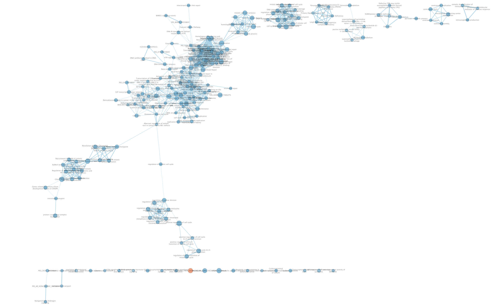
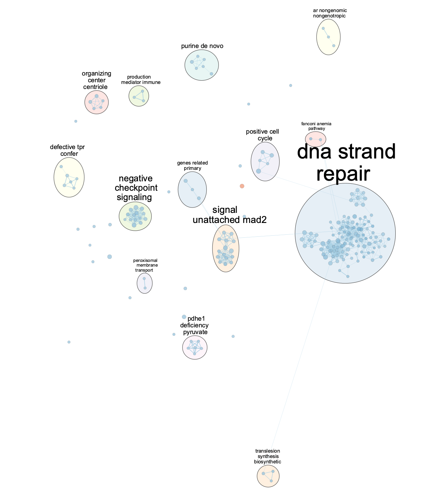
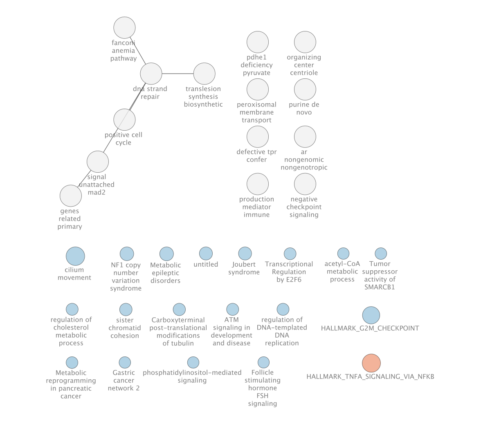
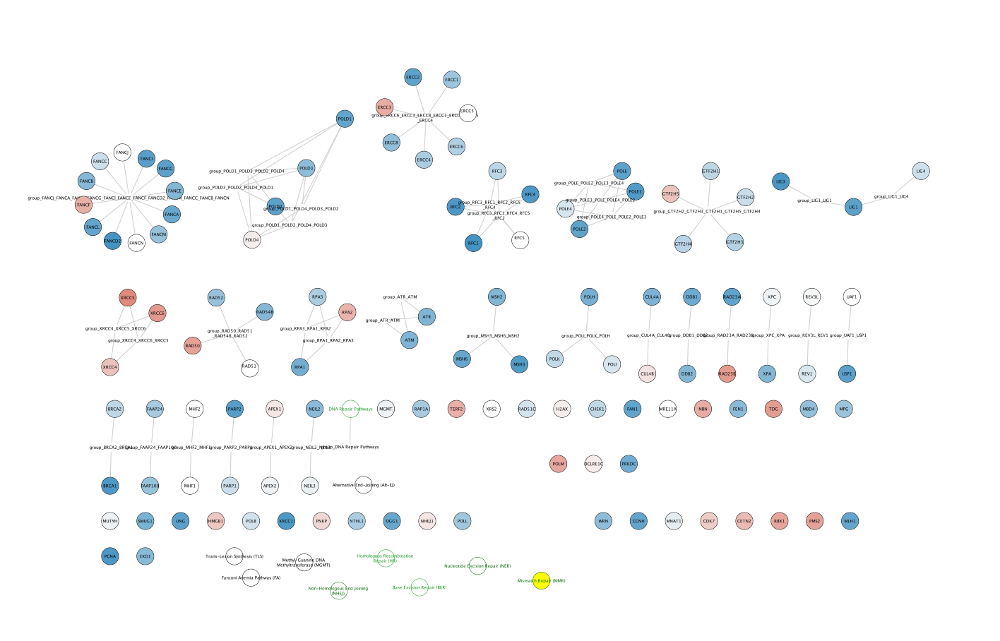

# 1 - Overview of Prior Processing and Analysis
**About the Dataset**         
The dataset I selected is called “SF3B1 promotes glycolysis and tumor malignancy through splicing-independent activation of HIF1α [RNA-Seq]” (GEO accession: GSE201427).It published as a part of a Cell publication understanding the role of splicing factor SF3B1 in tumor progression. Although the full study contained multiple datasets, in this series of analysis I only used the bulk RNA sequencing dataset with 3 samples of Panc-1 cell line samples treated with control siRNA, and 3 samples of the same cell types treated with SF3B1 targeting siRNA. SF3B1 is a splicing factor hypothesized to be a contributor to a tumor’s adaptation to hypoxia, or low oxygen environments [@simmler2022sf3b1]. Detailed information about the dataset and the source are printed at the end of this section.


**About the Prior Processing**         
In the previous two reports, I have completed the steps below:        

- Downloaded the dataset from GEO using `GEOquery` [@geoquery], `tidyverse` [@tidyverse], and `readxl` [@readxl].         
- Cleaned the data by removing duplicates and low counts.         
- Normalized the data with the TMM normalization method, referring to the read depths from the SRA Run Selector [@sra_run_selector] and using built in functions from `edgeR` [@robinson2010edger].          
- Conducted differential gene expression analysis using the Quasi likelihood test in `edgeR` [@robinson2010edger].         
- Conducted over-representation analysis using the `g:profiler` web app tool [@gprofiler]. The thresholds of FDR p-value 0.005 and logFC value of absolute 1.25 were used to create the thresholded gene lists for up and down regulated genes. The following data sources were used: GO Biological Process [@GO1] [@GO2], Reactome [@reactome], and KEGG [@kegg1] [@kegg2] [@kegg3].            

Given the length of the code and to avoid redundancy, I omitted the code block for these processes from the output html of this report. Any relevant analysis or data from prior reports are included or mentioned in the relevant sections. However, if necessary, please refer to my previous reports for further details about the analysis or rationale behind the prior processing of this data, please refer to my previous reports.         

* [A1 - up to normalization](https://github.com/bcb420-2025/Izumi_Ando/blob/main/A1_Izumi_Ando/Izumi_Ando.html)         
* [A2 - up to over-representation analysis](https://github.com/bcb420-2025/Izumi_Ando/blob/main/A2_Izumi_Ando.html)         
```{r include = FALSE}
if (!require("BiocManager", quietly = TRUE)) {
  install.packages("BiocManager")
}
if (!requireNamespace("GEOquery", quietly = TRUE)) {
  BiocManager::install("GEOquery")
}
if (!requireNamespace("tidyverse", quietly = TRUE)) {
  install.packages("tidyverse")
} # readxl included in tidyverse install
if (!requireNamespace("edgeR", quietly = TRUE)) {
  install.packages("edgeR")
}

# 1 - Overview of Prior Processing and Analysis
library("GEOquery") # to download dataset
library("tidyverse") # to use readxl
library("readxl")  # to read the datafile
library("knitr") # to produce visually cleaner tables
library("edgeR") # for TMM normalization & differential expression analysis

# code adapted from BCB420 Lecture 4 Get the Data

##### PART 1 - Downloading the data
# getting the GEO description
geo_id <- "GSE201427"
gse <- GEOquery::getGEO(geo_id, GSEMatrix=FALSE)
supp_files <- GEOquery::getGEOSuppFiles(geo_id, fetch_files=FALSE)

# getting information about GPL
gpl_name <- names(GEOquery::GPLList(gse))[1]
gpl <- GEOquery::Meta(GEOquery::getGEO(gpl_name))

# getting the data file name (there is only one file for this dataset)
data_file <- supp_files$fname[1]

# only downloading dataset if it is not available locally
dir <- file.path(getwd())
data_file_path <- file.path(dir, geo_id, data_file)
if(!file.exists(data_file_path)){
  data_file_download <- GEOquery::getGEOSuppFiles(geo_id, 
                                                filter_regex = data_file, 
                                                baseDir = dir, 
                                                fetch_files = TRUE)
}

# reading in the data 
panc1_data <- readxl::read_xlsx(data_file_path) 

# Removing extra columns for different O2 exposure levels
panc1_data <- panc1_data[, c(1, 2, 5, 6, 7, 8, 9, 10)]

# Extract only numeric data (third column onwards)
numeric_data <- panc1_data[, 3:ncol(panc1_data)]

# printing the first few rows of the data
knitr::kable(head(panc1_data, 3), 
             format = "html", 
             align = "c", 
             caption = "Table 1: A glance at the current state of the data")

##### PART 2 - Characterizing the Samples
list_of_samples <- gse@gsms
samples_type <- do.call(rbind, 
                        lapply(list_of_samples,
                               FUN = function(x){c(x@header$title, 
                                                   x@header$characteristics_ch1)
                                 }))
colnames(samples_type) <- c("Sample Name", "Oxygen Exposure", 
                            "siRNA Treatment", "Cell Line")

samples_type[, "Oxygen Exposure"] <- gsub(samples_type[, "Oxygen Exposure"],
                                          pattern = "condition: ",
                                          replacement = "")

samples_type[, "siRNA Treatment"] <- gsub(samples_type[, "siRNA Treatment"],
                                          pattern = "treatment: ",
                                          replacement = "")

samples_type[, "Cell Line"] <- gsub(samples_type[, "Cell Line"],
                                          pattern = "cell line: ",
                                          replacement = "")

samples_type <- as.data.frame(samples_type)

# removing the samples not used in the analysis
samples_type_mod <- samples_type[-c(1, 2),]

##### PART 1 - removing rows without HUGO gene symbols

# removing all rows without hugo symbols
hugo_panc1_data <- panc1_data[panc1_data$Gene != "NA", ]

# reformatting data frame
geneCol <- hugo_panc1_data$Gene
# removing extra gene identifier columns
hugo_panc1_data <- hugo_panc1_data[, 3:length(hugo_panc1_data)]
# assigning HUGO symbols as the row names
rownames(hugo_panc1_data) <- geneCol

##### PART 2 - removing low counts

# code adapted from Lecture 5 Normalizing Our Dataset
# the min number of samples is three because the total number of samples is 6
min_num_samples <- 3
# removing log from data values as it is already in CPM form
cpm_non_log <- 2^hugo_panc1_data
data_matrix <- as.matrix(cpm_non_log)
keep <- rowSums(data_matrix > 1) > min_num_samples

filtered_panc1_data <- as.data.frame(data_matrix[keep,])
filtered_panc1_data <- log(filtered_panc1_data, base = 2) # back to log2-CPM

rem_rows <- nrow(hugo_panc1_data) - nrow(filtered_panc1_data)

##### PART 3 - removing duplicate rows
# checking for rows with the same read values by viewing data from both ends
duplicates <- duplicated(filtered_panc1_data) | duplicated(filtered_panc1_data, 
                                                           fromLast = TRUE)
num_dups <- nrow(filtered_panc1_data[duplicates, ])

# checking for rows with the same gene names
# geneCol is a list of HUGO symbols from the previous section
num_dup_genes <- length(unique(geneCol)) - length(geneCol)

# no rows were removed in this step

##### PART 1 - finding the read depths for each sample

# find read depths for all samples
gsm_accession <- gse@header$sample_id[3:length(gse@header$sample_id)]
srr_accession <- c("SRR18910178", 
                   "SRR18910177",
                   "SRR18910176",
                   "SRR18910175",
                   "SRR18910174",
                   "SRR18910173")
rd <- c(26644141, 
        25605704,
        27703630,
        27589690,
        29387569,
        25360887)
read_depths <- cbind(gsm_accession, srr_accession, rd)
sample_name <- samples_type$`Sample Name`[3:length(samples_type$`Sample Name`)]
rownames(read_depths) <- sample_name
read_depths <- as.data.frame(read_depths)
read_depths$rd <- as.numeric(read_depths$rd)

##### PART 2 - reverse calculating the raw counts from log-CPM

# not subtracting by 1, as it creates negative values
raw_panc1_data <- as.data.frame(2^filtered_panc1_data )

for(i in 1:length(sample_name)){
  sample <- sample_name[i]
  rd_value <- read_depths[rownames(read_depths) == sample, "rd"]
  raw_panc1_data[[sample]] <- raw_panc1_data[[sample]] * rd_value / 10^6
}

##### PART 3 - Applying TMM Normalization

# code adapted from lecture 5 normalizing our dataset
group_assignment <- samples_type$"siRNA Treatment"[3:length(samples_type$"siRNA Treatment")]
d <- edgeR::DGEList(counts=raw_panc1_data, group=group_assignment)
d <- edgeR::calcNormFactors(d)
normalized_counts <- cpm(d)

##### PART 1 - Differential Expression Analysis
# code adapted from Lecture 7 Differential Expression with edgeR

model_design <- model.matrix(~samples_type_mod$`siRNA Treatment`)
data <- edgeR::DGEList(counts=normalized_counts, 
                       group=samples_type_mod$`siRNA Treatment`)
data <- edgeR::estimateDisp(data, design=model_design)
fit <- edgeR::glmQLFit(data, design=model_design)
qlf.siCtrl_vs_siSF3B1 <- 
  edgeR::glmQLFTest(fit, coef="samples_type_mod$`siRNA Treatment`siSF3B1")
qlf_output_hits <- edgeR::topTags(qlf.siCtrl_vs_siSF3B1,
                           sort.by = "PValue",
                           n = nrow(normalized_counts))

# code adapted from Lecture 7 Intro to Pathway analysis

# PART1 - CREATING A RANKED LIST
# extracting just the hits table (identifiers are already gene names)
qlf_output_hits_table <- qlf_output_hits$table
qlf_output_hits_table[,"rank"] <- 
  -log(qlf_output_hits_table$PValue,base =10)*sign(qlf_output_hits_table$logFC)
qlf_output_hits_table <-
qlf_output_hits_table[order(qlf_output_hits_table$rank),]

# genes without gene symbols have already been removed in A1

# PART 2 - CREATING THRESHOLDED LISTS (up and down regualted genes)
# using FDR corrected p-values
upregulated_genes <- rownames(qlf_output_hits_table)[which(
  qlf_output_hits_table$FDR < 0.005 & qlf_output_hits_table$logFC > 1.25)]

downregulated_genes <- rownames(qlf_output_hits_table)[which(
  qlf_output_hits_table$FDR < 0.005 & qlf_output_hits_table$logFC < -1.25)]

significant_genes <- c(upregulated_genes, downregulated_genes)
```

#### Information About the Series (GSE)

**Title:** `r gse@header$title`\
**GEO Accession:** `r gse@header$geo_accession`\
**Submission Date:** `r gse@header$submission_date`\
**Last Update:** `r gse@header$last_update_date`\
**Associated Publication PubMed ID:** `r gse@header$pubmed_id`\ 
**Contact Information:**\
   **Contact Name:** `r gse@header$contact_name`\
   **Contact Institute:** `r gse@header$contact_institute`\
   **Contact Name:** `r gse@header$contact_email`


#### Information About the Platform (GPL)

**Platform Name:** `r gpl$title`\
**GEO Accession:** `r gpl$geo_accession`\
**Number of Associated Samples on Geo:** `r length(gpl$sample_id)`\

# 2 - Non-thresholded Gene Set Enrichment Analysis
Taking the output from the differential gene expression analysis using the Quasi likelihood test with the `edgeR` package [@edger], I conducted non-thresholded gene set enrichment analysis using the `GSEA` v4.4.0 for MacOS (silicon) Java app [@gsea1] [@gsea2]. In the code blocks below, I created a ranked list and downloaded the March 1st, 2025 Bader Lab gene set file without gene sets inferred from electronic annotation (no IEA). Table 1 lists the parameters and inputs used to run the GSEA pre-ranked analysis, and the legend includes the rationale behind the selection. 

**Creating a Ranked List & Downloading gene set file from the Bader Lab**
```{r warning=FALSE, message=FALSE}
# VARIABLES FROM HIDDEN CODE TEXT IN SECTION 1
# qlf_output_hits_table : Differential Expression results from edgeR

# creating a ranked list 
ranked_list <- 
  -log10(qlf_output_hits_table$FDR) * sign(qlf_output_hits_table$logFC)
names(ranked_list) <- rownames(qlf_output_hits_table)
ranked_list <- sort(ranked_list, decreasing = TRUE)

# saving the ranked list in a .rnk file for GSEA
write.table(ranked_list, 
            file = "ranked_genes_a3.rnk", 
            sep = "\t", 
            quote = FALSE, 
            col.names = FALSE)
```
**Downloading March 2025 Gene Set File from the Bader Lab**
```{bash eval=FALSE, warning=FALSE, message=FALSE}
# note my local machine uses MacOS
wget https://download.baderlab.org/EM_Genesets/March_01_2025/Human/symbol/Human_GOBP_AllPathways_noPFOCR_no_GO_iea_March_01_2025_symbol.gmt
```


| Parameter / Input | Selection |
|----------|----------|
| Ranked List  | ranked_genes_a3.rnk (from above)  |
| Geneset | [Human_GOBP_AllPathways_noPFOCR_no_GO_iea_March_01_2025_symbol.gmt](https://download.baderlab.org/EM_Genesets/March_01_2025/Human/symbol/Human_GOBP_AllPathways_noPFOCR_no_GO_iea_March_01_2025_symbol.gmt) |
| Max Gene Set Size | 200 |
| Min Gene Set Size | 15 |
| Number of permutations | 1000 (Default) |
| Collapse / Remap to symbols | No_Collapse |
| Enrichment Statistic | weighted (Default) |

**Table 1: Parameters and Inputs used to run GSEA Enrichment Analysis**           
The March 1st, 2025 Bader Lab gene set file was used because it was the most recent geneset and the hits from the thresholded over representation anlaysis were from GO Biological Pathways. The max gene set size was set to 200 to keep the results focused and interpretable, the min gene set size was set to 15 to avoid over sensitivity of the analysis and to avoid false positives. The rest of the parameters were set to default values as listed above.

## Analysis of Results
Similar to the thresholded over representation done with `g:profiler`, the `GSEA` pre-ranked analysis also returned many hits for the down enriched genes but less and also weaker hits for up enriched gene sets. The top hits and summary of the results for all enriched gene sets is listed in Table 2 below. The comparison between the results here and the `g:profiler` results are somewhat straightforward, because the key words "DNA replication" and "DNA elongation" were both in the top hits in the `g:profiler` results in A2. On the other hand, the key words "cell cycle" and "DNA repair" were not included in the `GSEA` results. It is worth noting, that "DNA replication" is part of the "cell cycle" and the results were filtered by max gene set size of 200, so "cell cycle" may have been omitted by size. The only up enriched gene set was for "HALLMARK_TNFA_SIGNALING_VIA_NFKB", a biological pathway known to be related to cancer cell migration [@upreg]. This result aligns with both the `g:profile` results from A2 but slightly strays from the hypothesis of the original study. In A2, the high ranking hits were immune response pathways, and TNFα (Tumor Necrosis Factor alpha) is a pro-inflammatory cytokine [@tnfa]. On the other hand, the original study hypothesized that knocking out the SF3B1 gene would lead to reduced tumor progression and these results show that this the SF3B1 knockout is enriching a biological pthway related to cancer cell migration. It is too early to draw any conclusions, but it is worth noting here that this is the only notably up enriched gene set in this analysis and the many other cell-proliferation-related biological processes are down enriched at higher significant levels which could suggest that the overall trajectory of the changes happening to the cells are going against cell proliferation.

| Gene Set | NES | FDR q-value | Direction | Number of Genes on Leading Edge |
|----------|----------|----------|----------|----------|
| DNA REPLICATION%GOBP%GO:0006260 | -2.52 | 0.000 | Down | 88 |
| DNA-TEMPLATED DNA REPLICATION%GOBP%GO:0006261 | -2.52 | 0.000 | Down | 68 |
| ACTIVATION OF THE PRE-REPLICATIVE COMPLEX%REACTOME%R-HSA-68962.6 | -2.45 | 0.000 | Down | 21 |
| DNA STRAND ELONGATION INVOLVED IN DNA REPLICATION%GOBP%GO:0006271 | -2.40 | 0.000 | Down | 12 |
| HALLMARK_TNFA_SIGNALING_VIA_NFKB%MSIGDBHALLMARK%HALLMARK_TNFA_SIGNALING_VIA_NFKB | 2.35 | 0.021 | Up | 59 |
**Table 2: Top GSEA Results**        
Selected top hits from the non-thresholded over representation analysis using GSEA. 4 were selected from down enriched genes with a NES threshold of <= -2.4 as many of the results had a q-value of 0, and 1 from up enriched genes were selected with a conventional q-value threshold of 0.05.

# 3 - Visualizing with Cytoscape
For further analysis, I visualized the `GSEA` results on `Cytoscape` v3.10.3 for MacOS [@cytoscape], using the apps `EnrichmentMap` v3.5.0. [@em], `AutoAnnotate` v1.5.2 [@autoannotate], and `yFiles Layout Algorithms` v1.1.5 developed by yWorks GmbH. 


In the initial output of `EnrichmentMap` (Figure 1) there were multiple tightly connected clusters along with a few independent nodes. Notably, there was only one node from the enriched gene sets, which was "HALLMARK_TNFA_SIGNALING_VIA_NFKB" similar to the analysis done in Section 2. These clusters were further characterized in Figure 2, where `AutoAnnotate` identified 14 distinct clusters. The three largest downregulated themes—DNA strand repair (115 gene sets), signal unattached MAD2 (15 gene sets), and negative checkpoint signaling (14 gene sets)—reflect a coordinated suppression of pathways essential for genomic maintenance, mitotic fidelity, and cell cycle progression. This pattern suggests a cellular state characterized by impaired DNA damage response, reduced enforcement of the spindle assembly checkpoint, and reactivation of checkpoint control mechanisms that would otherwise be bypassed in proliferative cancer cells. These observations contrast sharply with findings from the original paper, where SF3B1 overexpression in pancreatic cancer was shown to promote malignancy via HIF1-mediated transcriptional and metabolic reprogramming, supporting cell survival and proliferation under hypoxic stress [@simmler2022sf3b1]. The downregulation of additional themes related to metabolism (e.g., purine de novo, pdhe1 deficiency/pyruvate, peroxisomal transport) and structural mitotic components (e.g., organizing center/centriole, positive cell cycle) further supports a model of global proliferative arrest. Collectively, these results suggest a cellular phenotype that is antithetical to SF3B1-driven tumor progression, potentially reflective of SF3B1 loss, hypoxic failure, or therapeutic suppression of malignant traits. Lastly, in the collapsed and annotated network (Figure 3), we can see that many of the gene sets that were not included in the clustering are aligned with some of the themes. This indicates that they were simply isolated due to lack of overlapping genes. 

       
**Figure 1. Initial Enrichment Map**        
The initial enrichment map of the thresholded gene set analysis results, created using the EnrichmentMap app in Cytoscape. There are 207 nodes (gene sets) and 1038 edges (sets of overlapping genes). The thresholds used to generate this were a q-value of 0.05 for node cut off and the default 0.375 Jaccard+Overlap similarity for edge cut off. The visual components are not manually modified with the exception for the node color mapping. The labels on the nodes are the gene set names and the colors are blue for negative NES score and orange for positive. The node size indicates the size of the gene set. There is only one gene set in the network with a positive rank value, and it is "HALLMARK_TNFA_SIGNALING_VIA_NFKB", the only gene set identified as up enriched in the analysis of the results table from GSEA.

       
**Figure 2. Annotated Enrichment Map**        
Annotated enrichment map, created on Cytoscape using the app AutoAnnotate from the network in Figure 1. This shows enriched biological pathways, where nodes represent gene sets and edges reflect shared genes. Similar to Figure 1, node size corresponds to gene set size, edge thickness indicates number of overlapping genes, and the color of the nodes are represent the NES value (orange for positive, blue for negative). The layout of the network was rearranged from Figure 1 and the labels for individual gene sets were removed for readability. Pathways were grouped into 14 clusters based on word frequencies and labeled with representative terms (e.g., dna strand repair, negative checkpoint signaling).       

       
**Figure 3. Collapsed, Annotated Enrichment Map**        
Taking the Annotated Enrichment Map from Figure 2, I collapsed the themes, and created a new network with the themes (white nodes) and the gene sets that were left out of the clustering (bluw: down enriched, orange: up enriched). In this network, the edges do not hold any weight but do indicate shared genes between the gene sets in the different themes. The node sizes of the themes do not indicate any information, while the node sizes of the colored nodes indicate gene set size. The layout was adjusted for readability. 

# 4 - Interpretation - Investigating a specific pathway
### Creating the Gene Network
To dig deeper, I selected the "DNA REPAIR PATHWAYS FULL NETWORK" a semi-hub node within the subgroups in the DNA strand repair theme and further analyzed the genes in the pathway using `WikiPathways` v 3.3.11 [@wikipath]. I selected this gene set because for the reasons given in the previous sentence as well as the fact that it was more interesting and informative than the others I explored. The nodes are genes or other key words included in the Wiki Pathways dataset, and the blue nodes are down regulated genes while the orange are up regulated (colored by rank value).

       
**Figure 4. Network of DNA Repair Pathways**        
Network of genes in the "DNA REPAIR PATHWAYS FULL NETWORK" created using `WikiPathways` in `Cytoscape`.  The nodes are genes or other key words included in the Wiki Pathways dataset, and the blue nodes are down regulated genes while the orange are up regulated (colored by rank value). The white nodes are genes that were neigher up or down regulated or not included in the original dataset.

## Analysis 
The network visualization of DNA repair genes shows widespread downregulation (blue nodes) across multiple repair pathways, including homologous recombination (HR), nucleotide excision repair (NER), mismatch repair (MMR), and base excision repair (BER). In the HR pathway, key genes such as BRCA1, RAD51, RAD52, FANCD2, and FANCA are notably downregulated, suggesting a diminished capacity for error-free repair of double-strand breaks [@wp1] [@wp2]. Within the NER pathway, several critical genes including ERCC1, ERCC2, ERCC4, and XPA also show decreased expression, indicating reduced ability to correct bulky DNA adducts and helix-distorting lesions [@wp3]. The MMR pathway is similarly affected, with MSH2, MSH6, MLH1, and PMS2 downregulated—genes essential for correcting base mispairing and maintaining genomic stability [@wp4]. For BER, the downregulation of genes like OGG1, APEX1, POLB, and NEIL2 highlights potential impairment in the repair of oxidative and alkylation damage [@wp5] [@wp6]. Together, these changes suggest a broad suppression of DNA repair capacity, which may compromise tumor cell survival in hypoxic environments where DNA damage stress is elevated. This pattern aligns with findings from the SF3B1 study, which demonstrated that SF3B1 is a critical co-activator of HIF1α and is required for the proper transcriptional response to hypoxia. In the context of pancreatic cancer, where hypoxia is a key driver of tumor adaptation, reduced SF3B1 levels impaired HIF1 target gene activation [@simmler2022sf3b1]. Since some DNA repair genes are known or suspected targets of HIF1 signaling under low oxygen [@wp7], the observed down regulation may reflect compromised hypoxia adaptation due to disrupted SF3B1-HIF1 activity. This impairment likely undermines the tumor’s ability to maintain genome integrity under stress, contributing to the reduced tumor progression observed in SD3B1 heterozygous mouse models [@simmler2022sf3b1]. A few genes, such as TERF2, REV3L, and POLM, were upregulated (orange nodes), potentially indicating compensatory or SF3B1-independent responses. Overall, this expression pattern supports the paper’s central claim that SF3B1 is essential for hypoxic transcriptional programs and extends its impact to DNA repair pathways.

# 5 - Conclusion
In this analysis, I examined the transcriptional effects of SF3B1 knockdown in Panc-1 cells, with a focus on its role in hypoxia adaptation and DNA repair regulation. Building on prior normalization and differential expression analysis, I used both thresholded (g:profiler) and non-thresholded (GSEA) gene set enrichment approaches, followed by network-based visualization in Cytoscape. The results consistently pointed toward a coordinated downregulation of multiple DNA repair pathways—including HR, NER, MMR, and BER—upon SF3B1 silencing.

The suppression of DNA repair genes suggests that SF3B1 contributes to maintaining genomic stability, possibly through its role as a transcriptional co-activator of HIF1α under hypoxic stress. The findings align with the original study’s model that SF3B1 promotes tumor survival in low oxygen environments by facilitating hypoxic transcriptional programs. However, in contrast to the pro-oncogenic effects of SF3B1 observed in vivo, the results here highlight the anti-proliferative consequences of SF3B1 loss, including the repression of cell cycle and DNA replication pathways.

Overall, this report supports the notion that SF3B1 is a central regulator of both metabolic and genome maintenance responses to hypoxia. Its knockdown appears to impair the tumor cell’s ability to adapt to oxygen deprivation, potentially revealing therapeutic vulnerabilities. Future analysis may benefit from integrating temporal data and protein-level validation to further refine the mechanistic understanding of SF3B1’s dual role in RNA splicing and transcriptional regulation during hypoxia, as well as further exploration of the other themes and gene sets not explored in Section 4.
# 6 - References